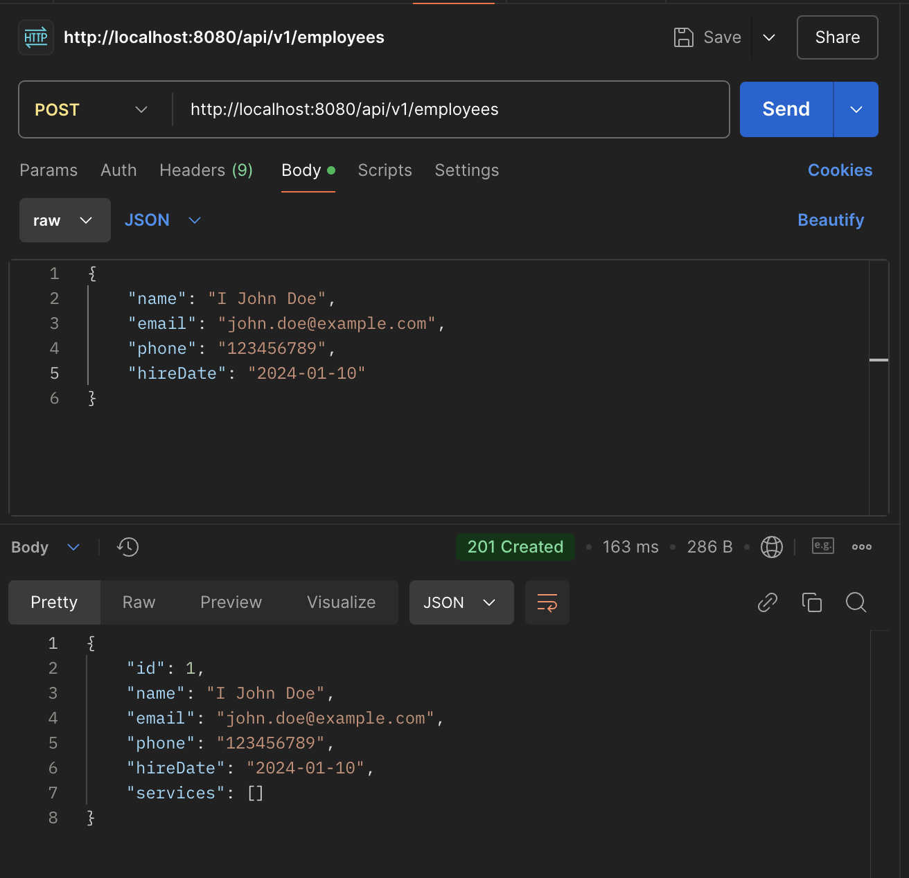
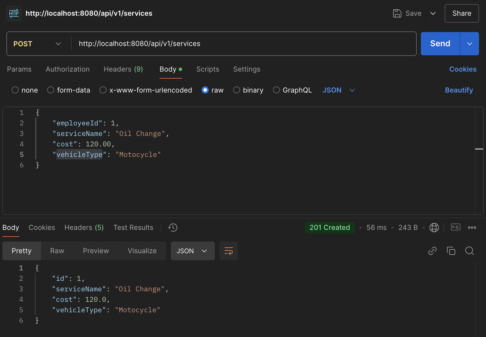
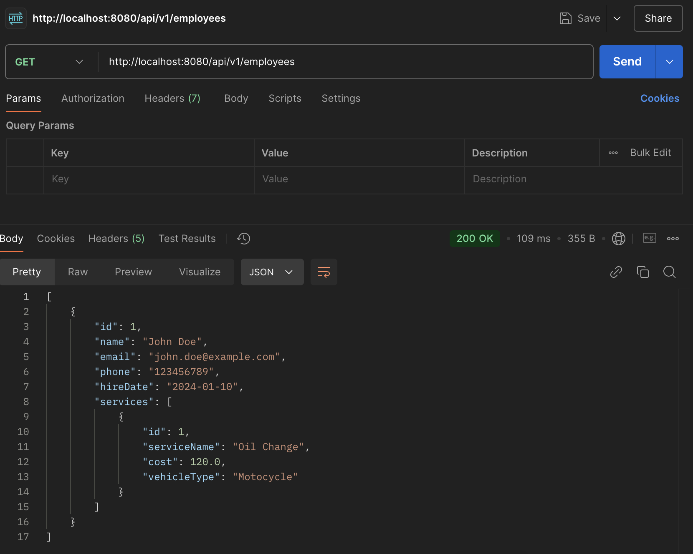
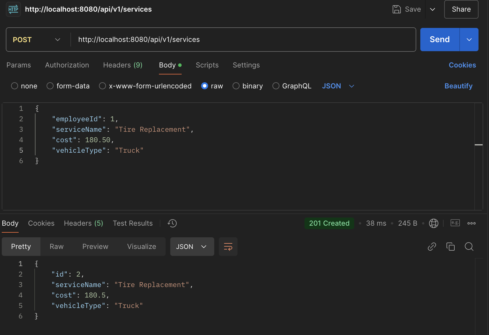
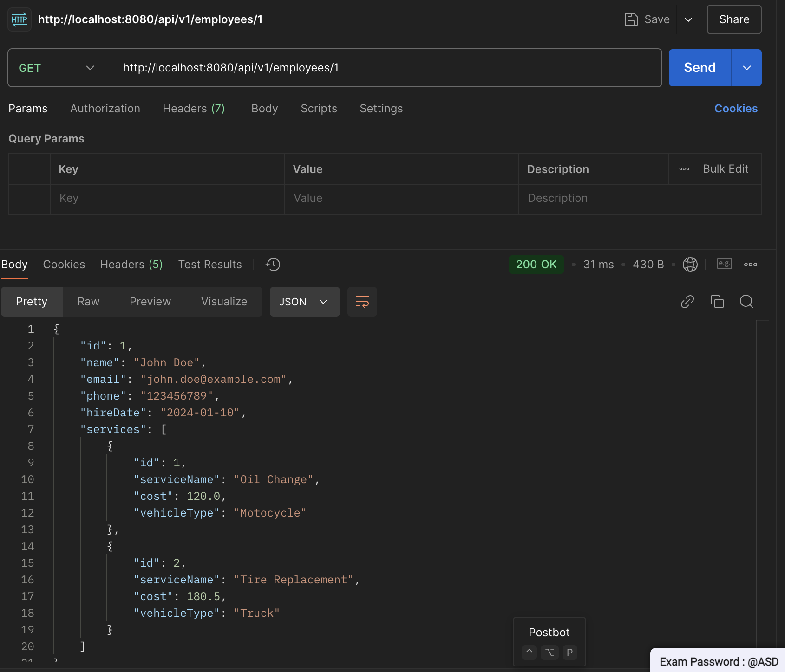
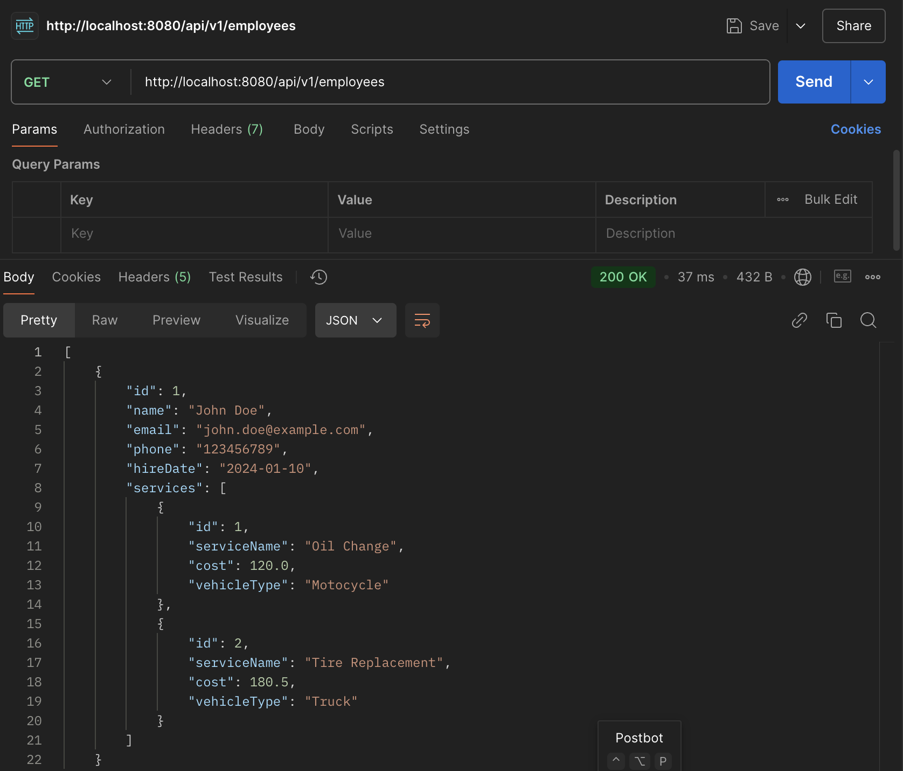
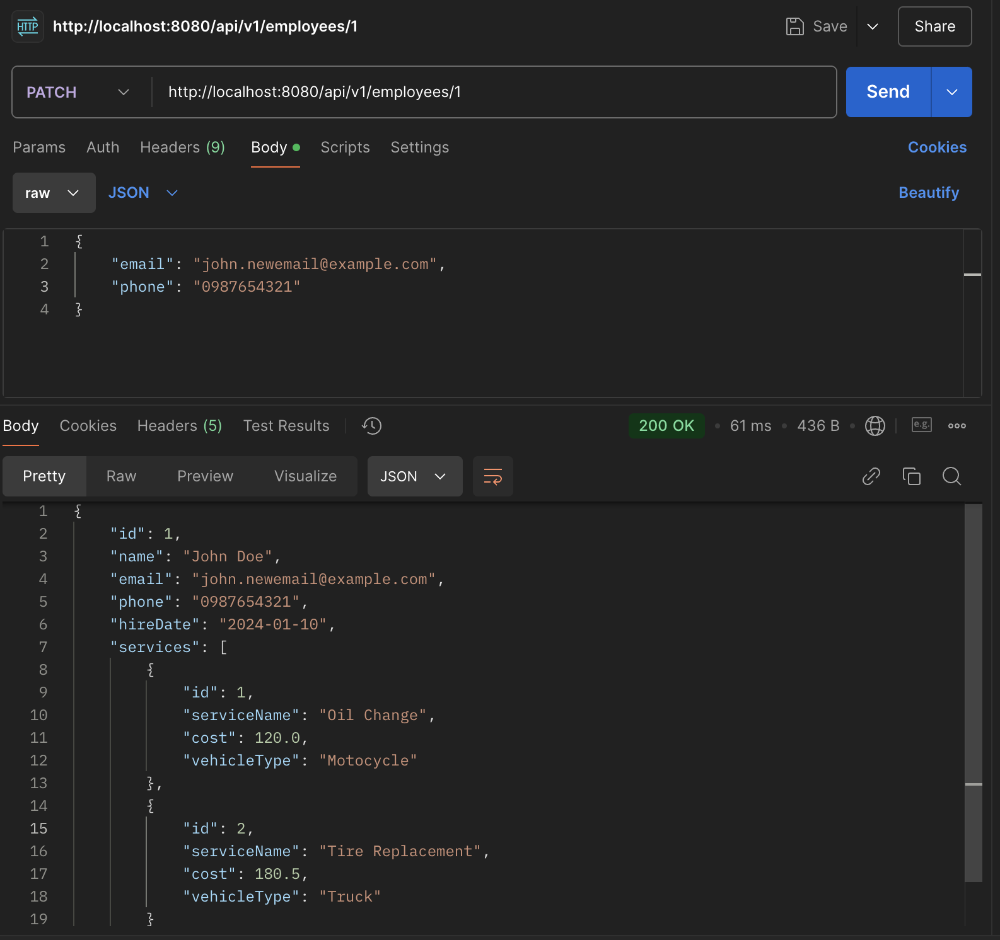
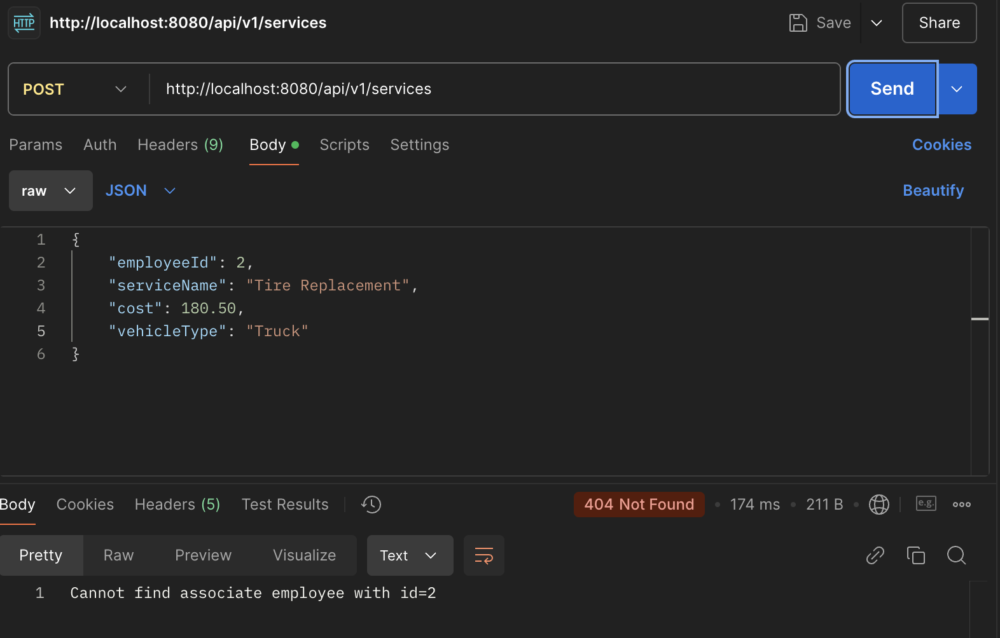
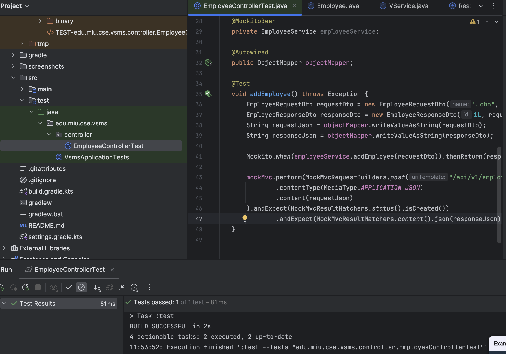

**POST: http://localhost:8080/api/v1/employees**
```
{
  "name": "John Doe",
  "email": "john.doe@example.com",
  "phone": "1234567890",
  "hireDate": "2024-01-10"
}
```
**Response**
```
{
  "id": 1,
  "name": "John Doe",
  "email": "john.doe@example.com",
  "phone": "1234567890",
  "hireDate": "2024-01-10",
  "services": [ ]
}
```
**Screenshot**



**POST: http://localhost:8080/api/v1/services**
```
{
  "employeeId": 1,
  "serviceName": "Oil Change",
  "cost": 120.00,
  "vehicleType": "Motorcycle"
}
```
**Response**
```
{
    "id": 1,
    "serviceName": "Oil Change",
    "cost": 120.0,
    "vehicleType": "Motorcycle"
}
```
**Screenshot**


**GET: http://localhost:8080/api/v1/employees**
**Response**
```
[
    {
        "id": 1,
        "name": "John Doe",
        "email": "john.newemail@example.com",
        "phone": "0987654321",
        "hireDate": "2024-01-10",
        "services": [
            {
                "id": 1,
                "serviceName": "Oil Change",
                "cost": 120.0,
                "vehicleType": "Motorcycle"
            }
        ]
    }
]
```
**Screenshot**


**POST: http://localhost:8080/api/v1/services**
```
{
  "employeeId": 1,
  "serviceName": "Tire Replacement",
  "cost": 180.50,
  "vehicleType": "Truck"
}
```

**Response**
{
    "id": 2,
    "serviceName": "Tire Replacement",
    "cost": 180.5,
    "vehicleType": "Truck"
}

**Screenshot**


**GET: http://localhost:8080/api/v1/employees/1**
**Response**
```
{
    "id": 1,
    "name": "John Doe",
    "email": "john.doe@example.com",
    "phone": "1234567890",
    "hireDate": "2024-01-10",
    "services": [
        {
            "id": 1,
            "serviceName": "Oil Change",
            "cost": 120.0,
            "vehicleType": "Motorcycle"
        },
        {
            "id": 2,
            "serviceName": "Tire Replacement",
            "cost": 180.5,
            "vehicleType": "Truck"
        }
    ]
}
```
**Screenshot**

**GET: http://localhost:8080/api/v1/employees**
**Response**
```
[
    {
        "id": 1,
        "name": "John Doe",
        "email": "john.doe@example.com",
        "phone": "1234567890",
        "hireDate": "2024-01-10",
        "services": [
            {
                "id": 1,
                "serviceName": "Oil Change",
                "cost": 120.0,
                "vehicleType": "Motorcycle"
            },
            {
                "id": 2,
                "serviceName": "Tire Replacement",
                "cost": 180.5,
                "vehicleType": "Truck"
            }
        ]
    }
]
```
**Screenshot**

**PATCH: http://localhost:8080/api/v1/employees/1**
```
{
  "email": "john.newemail@example.com",
  "phone": "0987654321"
}
```
**Response:**
```
{
    "id": 1,
    "name": "John Doe",
    "email": "john.newemail@example.com",
    "phone": "0987654321",
    "hireDate": "2024-01-10",
    "services": [
        {
            "id": 1,
            "serviceName": "Oil Change",
            "cost": 120.0,
            "vehicleType": "Motorcycle"
        },
        {
            "id": 2,
            "serviceName": "Tire Replacement",
            "cost": 180.5,
            "vehicleType": "Truck"
        }
    ]
}
```
**Screenshot**


**Global Exception Handler**


**Unit testing**
